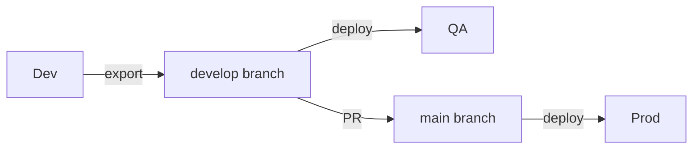

# CLAUDE.md - Power Platform Developer Suite Demo Solution

**Essential rules for AI assistants working on this Dynamics 365 / Dataverse demo solution.**

This repository is a **demonstration solution** for showcasing the [Power Platform Developer Suite](https://github.com/your-org/Power-Platform-Developer-Suite) VS Code extension. It contains reference implementations for plugins, web resources, cloud flows, custom APIs, and other Power Platform components.

---

## Purpose & Goals

1. **Showcase extension capabilities** - Demonstrate what the VS Code extension can do
2. **Reference material** - Provide AI-assistable patterns for Dynamics 365 development
3. **Best practices** - Model proper solution structure, naming, and architecture
4. **Not production code** - This is educational/demo, not real business logic

---

## Solution Overview

- **Solution Name:** Power Platform Developer Suite Demo
- **Publisher Prefix:** `ppds`
- **Schema Prefix:** `ppds_`

---

## Project Structure

```
/
├── CLAUDE.md                              # This file - AI coding guide
├── src/
│   ├── Plugins/                           # Classic plugin assembly
│   │   └── PPDSDemo.Plugins/
│   │       ├── Entities/                  # Early-bound entity classes
│   │       ├── Plugins/                   # Plugin classes
│   │       └── Services/                  # Shared business logic
│   │
│   ├── PluginPackages/                    # Modern plugin package (NuGet-based)
│   │   └── PPDSDemo.PluginPackage/
│   │
│   ├── WorkflowActivities/                # Custom workflow activities
│   │   └── PPDSDemo.Workflow/
│   │
│   ├── CustomAPIs/                        # Custom API implementations
│   │   └── PPDSDemo.CustomAPIs/
│   │
│   ├── PCF/                               # PCF controls
│   │   └── PPDSDemo.Controls/
│   │
│   └── WebResources/                      # JavaScript, HTML, CSS, images
│       └── ppds_/
│           ├── scripts/                   # JavaScript files
│           ├── html/                      # HTML web resources
│           ├── css/                       # Stylesheets
│           └── images/                    # Image resources
│
├── solutions/
│   ├── PPDSDemo/                          # Unpacked solution (source control)
│   │   ├── src/
│   │   │   ├── Entities/                  # Table definitions
│   │   │   ├── OptionSets/                # Global option sets
│   │   │   ├── Workflows/                 # Cloud flows, classic workflows
│   │   │   ├── PluginAssemblies/          # Assembly registration
│   │   │   ├── SdkMessageProcessingSteps/ # Plugin step registration
│   │   │   └── WebResources/              # Web resource definitions
│   │   └── Other/
│   │       ├── Solution.xml
│   │       └── Customizations.xml
│   │
│   └── exports/                           # Exported solution zips
│
├── tests/
│   ├── PPDSDemo.Plugins.Tests/            # Plugin unit tests
│   └── PPDSDemo.Workflow.Tests/           # Workflow activity tests
│
├── tools/                                 # Build scripts, deployment tools
│
└── docs/                                  # Documentation (future)
```

---

## Tech Stack

### C# Projects (Plugins, Workflows, Custom APIs)

- **.NET Framework 4.6.2** - Required for Dataverse plugin sandbox
- **Microsoft.CrmSdk.CoreAssemblies** - Core SDK (IPlugin, IOrganizationService)
- **Microsoft.CrmSdk.Workflow** - Workflow activity base classes
- **Microsoft.CrmSdk.XrmTooling.CoreAssembly** - Tooling utilities
- **FakeXrmEasy** or **DataversePluginTemplate** - Testing framework

### Web Resources (JavaScript/TypeScript)

- **TypeScript** (optional but recommended) - Compile to ES5 for browser compatibility
- **Xrm SDK** - `Xrm.Page`, `Xrm.WebApi`, form context APIs
- **No external dependencies** - Web resources must be self-contained

### PCF Controls

- **TypeScript** - Required for PCF
- **React** (optional) - For complex UI controls
- **Fluent UI** - Microsoft's design system (recommended for consistency)

---

## Naming Conventions

### Solution Components

| Component | Convention | Example |
|-----------|------------|---------|
| Tables (Entities) | `ppds_PascalCase` | `ppds_DemoEntity` |
| Columns (Attributes) | `ppds_camelcase` | `ppds_customfield` |
| Option Sets | `ppds_PascalCase` | `ppds_DemoStatus` |
| Web Resources | `ppds_/path/name.ext` | `ppds_/scripts/account.js` |
| Plugin Steps | `PPDSDemo.Plugins.{Entity}{Message}` | `PPDSDemo.Plugins.AccountPreCreate` |
| Custom APIs | `ppds_PascalCaseName` | `ppds_CalculateDiscount` |

### C# Code

| Element | Convention | Example |
|---------|------------|---------|
| Namespaces | `PPDSDemo.{Area}` | `PPDSDemo.Plugins` |
| Plugin Classes | `{Entity}{Stage}{Message}Plugin` | `AccountPreCreatePlugin` |
| Workflow Activities | `{Action}Activity` | `SendNotificationActivity` |
| Services | `I{Name}Service` / `{Name}Service` | `IDiscountService` |

### JavaScript/TypeScript

| Element | Convention | Example |
|---------|------------|---------|
| Namespaces | `PPDSDemo.{Area}` | `PPDSDemo.Account` |
| Functions | `camelCase` | `onFormLoad` |
| Event Handlers | `on{Event}` | `onSave`, `onChange` |
| Files | `{entity}.{purpose}.js` | `account.ribbon.js` |

---

## Plugin Development Patterns

### Plugin Structure

```csharp
namespace PPDSDemo.Plugins
{
    /// <summary>
    /// Validates account data before creation.
    /// Registered: Account, Pre-operation, Create
    /// </summary>
    public class AccountPreCreatePlugin : IPlugin
    {
        public void Execute(IServiceProvider serviceProvider)
        {
            // 1. Get execution context
            var context = (IPluginExecutionContext)serviceProvider
                .GetService(typeof(IPluginExecutionContext));

            // 2. Get tracing service (ALWAYS use for debugging)
            var tracingService = (ITracingService)serviceProvider
                .GetService(typeof(ITracingService));

            // 3. Get organization service
            var serviceFactory = (IOrganizationServiceFactory)serviceProvider
                .GetService(typeof(IOrganizationServiceFactory));
            var service = serviceFactory.CreateOrganizationService(context.UserId);

            try
            {
                tracingService.Trace("AccountPreCreatePlugin: Starting execution");

                // 4. Get target entity
                if (!context.InputParameters.Contains("Target"))
                    return;

                var target = (Entity)context.InputParameters["Target"];

                // 5. Execute business logic
                ValidateAccount(target, tracingService);

                tracingService.Trace("AccountPreCreatePlugin: Completed successfully");
            }
            catch (Exception ex)
            {
                tracingService.Trace($"AccountPreCreatePlugin: Error - {ex.Message}");
                throw new InvalidPluginExecutionException(
                    $"An error occurred in AccountPreCreatePlugin: {ex.Message}", ex);
            }
        }

        private void ValidateAccount(Entity account, ITracingService trace)
        {
            // Business logic here
            trace.Trace("Validating account...");
        }
    }
}
```

### Plugin Best Practices

**ALWAYS:**
- Use `ITracingService` for all debug output (visible in Plugin Trace Viewer)
- Wrap execution in try/catch with `InvalidPluginExecutionException`
- Check for `Target` existence before accessing
- Use early-bound types where possible (generated with `pac modelbuilder`)
- Keep plugins focused - one responsibility per plugin

**NEVER:**
- Use `Console.WriteLine` or `Debug.WriteLine` (doesn't work in sandbox)
- Hardcode GUIDs or environment-specific values
- Make synchronous HTTP calls in synchronous plugins (use async patterns)
- Store state in static variables (sandbox recycles)
- Reference external assemblies not in the sandbox allow list

### Image Handling (Pre/Post Images)

```csharp
// Pre-image: entity state BEFORE the operation
if (context.PreEntityImages.Contains("PreImage"))
{
    var preImage = context.PreEntityImages["PreImage"];
    var previousStatus = preImage.GetAttributeValue<OptionSetValue>("statuscode");
}

// Post-image: entity state AFTER the operation
if (context.PostEntityImages.Contains("PostImage"))
{
    var postImage = context.PostEntityImages["PostImage"];
    var newStatus = postImage.GetAttributeValue<OptionSetValue>("statuscode");
}
```

### Plugin Packages (NuGet-based)

Plugin packages are modern plugins that support NuGet dependencies. They require specific configuration for Dataverse registration.

**PackageId Requirement:**

⚠️ **IMPORTANT:** Dataverse requires the publisher prefix in the `PackageId` inside the `.nupkg` file. The `pac plugin init` command does NOT add this prefix by default.

| Requirement | Example |
|-------------|---------|
| Format | `{publisherprefix}_{PackageName}` |
| This solution | `ppds_PPDSDemo.PluginPackage` |

**Error without prefix:**
```
The nuget file name does not contain a solution prefix
```

**Fix in .csproj:**
```xml
<PropertyGroup>
  <!-- IMPORTANT: Dataverse requires publisher prefix in PackageId -->
  <PackageId>ppds_PPDSDemo.PluginPackage</PackageId>
</PropertyGroup>
```

**Why this matters:**
- Dataverse validates the PackageId inside the nupkg (in `.nuspec`)
- The prefix must match the solution's publisher prefix where the package will be registered
- This is a Dataverse requirement, not a PAC CLI default

---

## Web Resource Patterns

### Form Script Structure

```typescript
/// <reference path="../typings/xrm.d.ts" />

namespace PPDSDemo.Account {

    // Form context - set on load, used throughout
    let _formContext: Xrm.FormContext;

    /**
     * Called when the account form loads.
     * @param executionContext The execution context from the form event.
     */
    export function onFormLoad(executionContext: Xrm.Events.EventContext): void {
        _formContext = executionContext.getFormContext();

        // Initialize form
        setFieldVisibility();
        registerChangeHandlers();
    }

    /**
     * Called when the account form is saved.
     * @param executionContext The execution context from the form event.
     */
    export function onFormSave(executionContext: Xrm.Events.SaveEventContext): void {
        const saveContext = executionContext.getFormContext();

        // Validation before save
        if (!validateRequiredFields(saveContext)) {
            executionContext.getEventArgs().preventDefault();
        }
    }

    /**
     * Called when the account type field changes.
     */
    export function onAccountTypeChange(): void {
        const accountType = _formContext.getAttribute("ppds_accounttype")?.getValue();

        // React to change
        updateDependentFields(accountType);
    }

    // Private helper functions
    function setFieldVisibility(): void {
        // Implementation
    }

    function registerChangeHandlers(): void {
        _formContext.getAttribute("ppds_accounttype")
            ?.addOnChange(onAccountTypeChange);
    }

    function validateRequiredFields(formContext: Xrm.FormContext): boolean {
        // Validation logic
        return true;
    }

    function updateDependentFields(accountType: number | null): void {
        // Update logic
    }
}
```

### Web API Calls

```typescript
namespace PPDSDemo.Api {

    /**
     * Retrieves an account by ID.
     */
    export async function getAccount(accountId: string): Promise<any> {
        try {
            const result = await Xrm.WebApi.retrieveRecord(
                "account",
                accountId,
                "?$select=name,accountnumber,ppds_customfield"
            );
            return result;
        } catch (error) {
            console.error("Error retrieving account:", error);
            throw error;
        }
    }

    /**
     * Calls a custom API.
     */
    export async function callCustomApi(
        apiName: string,
        parameters: Record<string, any>
    ): Promise<any> {
        try {
            const result = await Xrm.WebApi.online.execute({
                getMetadata: () => ({
                    boundParameter: null,
                    operationType: 0, // Action
                    operationName: apiName,
                    parameterTypes: {}
                }),
                ...parameters
            });

            if (result.ok) {
                return await result.json();
            } else {
                throw new Error(`API call failed: ${result.statusText}`);
            }
        } catch (error) {
            console.error(`Error calling ${apiName}:`, error);
            throw error;
        }
    }
}
```

### Web Resource Best Practices

**ALWAYS:**
- Use namespace pattern to avoid global pollution
- Store `formContext` from `executionContext.getFormContext()`
- Use `?.` optional chaining for attribute access
- Handle async errors with try/catch
- Use TypeScript with Xrm typings

**NEVER:**
- Use deprecated `Xrm.Page` (use `formContext` instead)
- Use `alert()` for user messages (use `Xrm.Navigation.openAlertDialog`)
- Reference DOM elements directly (forms don't guarantee DOM structure)
- Use `eval()` or dynamic script loading

---

## Testing Patterns

### Plugin Unit Testing with FakeXrmEasy

```csharp
[TestClass]
public class AccountPreCreatePluginTests
{
    private XrmFakedContext _context;
    private IOrganizationService _service;

    [TestInitialize]
    public void Setup()
    {
        _context = new XrmFakedContext();
        _service = _context.GetOrganizationService();
    }

    [TestMethod]
    public void Execute_WithValidAccount_ShouldSucceed()
    {
        // Arrange
        var target = new Entity("account")
        {
            Id = Guid.NewGuid(),
            ["name"] = "Test Account",
            ["ppds_accounttype"] = new OptionSetValue(1)
        };

        var pluginContext = _context.GetDefaultPluginContext();
        pluginContext.InputParameters["Target"] = target;
        pluginContext.MessageName = "Create";
        pluginContext.Stage = 20; // Pre-operation

        // Act
        _context.ExecutePluginWith<AccountPreCreatePlugin>(pluginContext);

        // Assert
        // Verify expected behavior
    }

    [TestMethod]
    [ExpectedException(typeof(InvalidPluginExecutionException))]
    public void Execute_WithInvalidAccount_ShouldThrow()
    {
        // Arrange
        var target = new Entity("account")
        {
            Id = Guid.NewGuid()
            // Missing required field
        };

        var pluginContext = _context.GetDefaultPluginContext();
        pluginContext.InputParameters["Target"] = target;
        pluginContext.MessageName = "Create";

        // Act
        _context.ExecutePluginWith<AccountPreCreatePlugin>(pluginContext);

        // Assert - Exception expected
    }
}
```

---

## Common Commands

### Development

```bash
# Build plugin project
dotnet build src/Plugins/PPDSDemo.Plugins/PPDSDemo.Plugins.csproj

# Run tests
dotnet test tests/PPDSDemo.Plugins.Tests/

# Pack solution (requires Power Platform CLI)
pac solution pack --zipfile solutions/exports/PPDSDemo.zip --folder solutions/PPDSDemo/src

# Unpack solution
pac solution unpack --zipfile solutions/exports/PPDSDemo.zip --folder solutions/PPDSDemo/src --processCanvasApps

# Generate early-bound classes
pac modelbuilder build --outdirectory src/Plugins/PPDSDemo.Plugins/Entities
```

### PCF Development

```bash
# Initialize PCF project
pac pcf init --namespace PPDSDemo.Controls --name MyControl --template field

# Build PCF control
npm run build

# Start test harness
npm start watch
```

### Deployment

```bash
# Import solution to environment
pac solution import --path solutions/exports/PPDSDemo_managed.zip

# Publish all customizations
pac solution publish
```

---

## Extension Integration Points

This demo solution is designed to showcase these VS Code extension features:

| Extension Feature | Demo Component |
|-------------------|----------------|
| **Plugin Trace Viewer** | Plugins with extensive tracing |
| **Metadata Browser** | Custom tables with relationships |
| **Web Resources Manager** | JS/HTML/CSS web resources |
| **Data Explorer** | Custom tables with sample data |
| **Environment Variables** | Solution-aware env vars |
| **Connection References** | Cloud flows with connections |
| **Solutions Explorer** | Solution with all component types |

---

## Thinking Modes

For complex/uncertain problems, trigger extended thinking:

- `"think"` - Standard extended reasoning
- `"think hard"` - More thorough analysis
- `"think harder"` - Deep analysis for architectural decisions

**When to use:**
- Plugin registration strategy (think)
- Solution layering decisions (think hard)
- Complex entity relationships (think)
- Cross-cutting concerns (think harder)

---

## Git & Commits

**Branch strategy:** Feature branches, squash merge to main

**Commit messages:**
```
feat: add account validation plugin
fix: correct status transition logic
docs: update plugin patterns
refactor: extract discount calculation service
```

**No AI attribution** in commits or PR descriptions. Keep messages clean and conventional.

---

## Documentation Standards

This section defines how documentation is written in this repository.

### File Naming Convention

**Pattern:** `{TOPIC}_{TYPE}.md` in SCREAMING_SNAKE_CASE

**Types:**
| Suffix | Purpose | Example |
|--------|---------|---------|
| `_GUIDE.md` | How-to, workflow, step-by-step | `GETTING_STARTED_GUIDE.md` |
| `_PATTERNS.md` | Reusable solutions, best practices | `DEPLOYMENT_PATTERNS.md` |
| `_REFERENCE.md` | Quick lookup, specifications | `PAC_CLI_REFERENCE.md` |
| `_STRATEGY.md` | Decision documentation, rationale | `ENVIRONMENT_STRATEGY.md` |
| `_OVERVIEW.md` | High-level introduction | `ALM_OVERVIEW.md` |

**Folder names:** lowercase (`docs/strategy/`, `docs/guides/`)

**Examples:**
```
✅ GOOD:
docs/strategy/ENVIRONMENT_STRATEGY.md
docs/guides/GETTING_STARTED_GUIDE.md
docs/reference/PAC_CLI_REFERENCE.md

❌ BAD:
docs/strategy/environment-strategy.md    # Not SCREAMING_SNAKE
docs/guides/GettingStarted.md            # Wrong format
docs/SETUP.md                            # Missing type suffix
```

### Document Structure

**All documents MUST have:**

```markdown
# Document Title

[Brief 1-2 sentence overview]

## 🚀 Quick Reference (if >400 lines)
[Scannable bullets, tables, key concepts]

## 📖 Detailed Content
[Main content sections]

## 🔗 See Also
- [Related Doc](link)
```

**Required elements:**
- Brief overview in first paragraph
- "See Also" section with cross-references (always last)
- Quick Reference section (if document exceeds 400 lines)

### Diagrams

**Use Mermaid** for flow diagrams (renders natively in GitHub):



**Use ASCII** only for very simple inline concepts.

### Content Guidelines

**DO:**
- Be concise (1-2 pages per strategy doc)
- Focus on decisions and rationale
- Link to Microsoft docs for deep dives (don't duplicate)
- Use tables for comparisons and specifications
- Show ✅/❌ examples for patterns
- Explain "why" for non-obvious choices

**DON'T:**
- Add dates to documents (use git history)
- Duplicate content across docs (link instead)
- Write long prose when a table suffices
- Use toy examples ("foo", "bar")

### Tone

- **Direct** - State decisions clearly ("We use X" not "One might consider X")
- **Opinionated** - This is reference architecture; own the decisions
- **Practical** - Focus on what to do, not theory
- **Professional** - No jokes or excessive casualness

### Version References

- Document patterns version-agnostically in prose
- Note specific versions in a "Tested With" section when relevant
- Use semantic version ranges in examples (`@v4` not `@v4.2.1`)

### Documentation Index

All documentation lives in `docs/` with this structure:

```
docs/
├── README.md                    # Navigation hub
├── strategy/                    # Decision documentation ("why")
│   ├── ALM_OVERVIEW.md
│   ├── ENVIRONMENT_STRATEGY.md
│   ├── BRANCHING_STRATEGY.md
│   └── PIPELINE_STRATEGY.md
├── guides/                      # How-to documentation
│   ├── GETTING_STARTED_GUIDE.md
│   └── DEPLOYING_CHANGES_GUIDE.md
├── pipelines/                   # Pipeline-specific docs
│   └── PIPELINE_OVERVIEW.md
└── reference/                   # Quick-reference material
    └── PAC_CLI_REFERENCE.md
```

---

## References

### Official Documentation
- [Power Platform Documentation](https://learn.microsoft.com/en-us/power-platform/)
- [Dataverse Developer Guide](https://learn.microsoft.com/en-us/power-apps/developer/data-platform/)
- [Plugin Development](https://learn.microsoft.com/en-us/power-apps/developer/data-platform/plug-ins)
- [Web Resources](https://learn.microsoft.com/en-us/power-apps/developer/model-driven-apps/web-resources)
- [PCF Documentation](https://learn.microsoft.com/en-us/power-apps/developer/component-framework/overview)

### Related Repositories
- [Power Platform Developer Suite](../Power-Platform-Developer-Suite) - The VS Code extension this demo showcases

---

**Remember:** This is a demo/reference solution. Prioritize clarity and showcasing patterns over production-level complexity.
