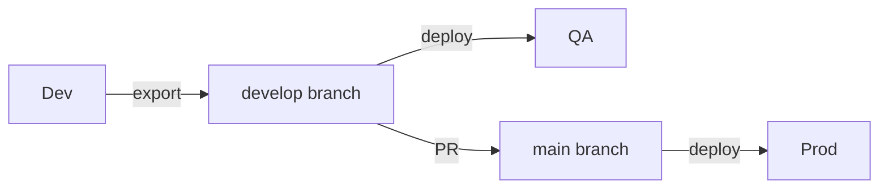

# Documentation Standards

Standards for writing documentation in this repository.

---

## File Naming Convention

**Pattern:** `{TOPIC}_{TYPE}.md` in SCREAMING_SNAKE_CASE

| Suffix | Purpose | Example |
|--------|---------|---------|
| `_GUIDE.md` | How-to, workflow, step-by-step | `GETTING_STARTED_GUIDE.md` |
| `_PATTERNS.md` | Reusable solutions, best practices | `WEBRESOURCE_PATTERNS.md` |
| `_REFERENCE.md` | Quick lookup, specifications | `PAC_CLI_REFERENCE.md` |
| `_STRATEGY.md` | Decision documentation, rationale | `ENVIRONMENT_STRATEGY.md` |
| `_OVERVIEW.md` | High-level introduction | `ALM_OVERVIEW.md` |

**Folder names:** lowercase (`docs/strategy/`, `docs/guides/`)

---

## Document Structure

All documents MUST have:

```markdown
# Document Title

[Brief 1-2 sentence overview]

---

## Main Content Sections

[Organized content]

---

## See Also

- [Related Doc](link)
```

**Required elements:**
- Brief overview in first paragraph
- "See Also" section with cross-references (always last)
- Horizontal rules (`---`) between major sections

---

## Content Guidelines

### DO

- Be concise (1-2 pages per strategy doc)
- Focus on decisions and rationale
- Link to Microsoft docs for deep dives (don't duplicate)
- Use tables for comparisons and specifications
- Explain "why" for non-obvious choices

### DON'T

- Add dates to documents (use git history)
- Duplicate content across docs (link instead)
- Write long prose when a table suffices
- Use toy examples ("foo", "bar")

---

## Diagrams

**Use Mermaid** for flow diagrams (renders natively in GitHub):



**Use ASCII** only for very simple inline concepts.

---

## Tone

- **Direct** - State decisions clearly ("We use X" not "One might consider X")
- **Opinionated** - This is reference architecture; own the decisions
- **Practical** - Focus on what to do, not theory
- **Professional** - No jokes or excessive casualness

---

## Version References

- Document patterns version-agnostically in prose
- Note specific versions in a "Tested With" section when relevant
- Use semantic version ranges in examples (`@v4` not `@v4.2.1`)

---

## See Also

- [docs/README.md](../README.md) - Documentation navigation hub
- [CLAUDE.md](../../CLAUDE.md) - AI coding guide
