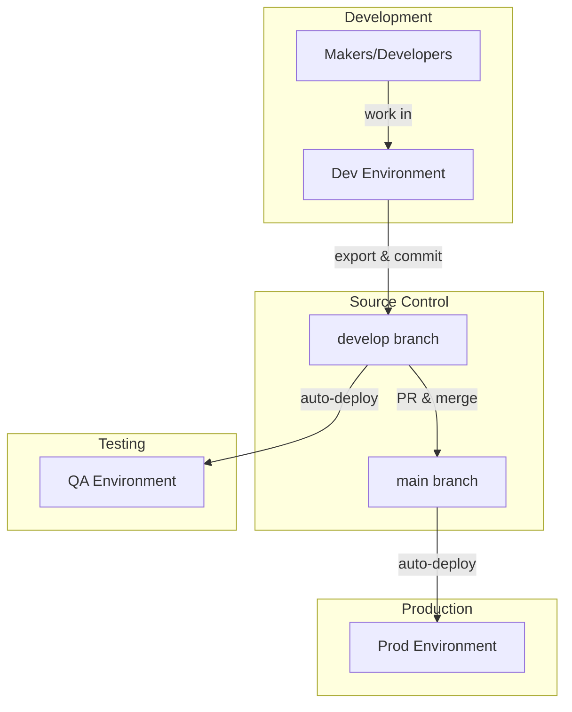

# ALM Overview

This document describes the Application Lifecycle Management (ALM) philosophy and principles used in this reference architecture.

---

## What This Architecture Provides

A practical, enterprise-ready ALM implementation for Power Platform that:

- Uses **source control as the source of truth** (Git/GitHub)
- Implements **CI/CD with PAC CLI** (portable to Azure DevOps)
- Supports **develop/main branching** for controlled releases
- Deploys **managed solutions** to non-development environments
- Provides **modular, extensible pipelines** for multi-solution scenarios

---

## Core Principles

### 1. Source Control is the Source of Truth

All solution changes are exported to Git and committed. If an environment is lost or corrupted, it can be rebuilt from source control.

**Implications:**
- Solutions are exported from Dev and unpacked to source control
- A single unified source is stored (using `--packagetype Both`)
- Same source builds both managed (Release) and unmanaged (Debug)
- Deployments to QA/Prod are built from source control, not exported from Dev

### 2. Environments Have Specific Purposes

Each environment serves a distinct role in the development lifecycle.

| Environment | Purpose | Solution Type |
|-------------|---------|---------------|
| **Dev** | Development and maker work | Unmanaged |
| **QA** | Testing and validation | Managed |
| **Prod** | Production use | Managed |

### 3. Managed Solutions for Deployment

Non-development environments receive managed solutions only. This ensures:

- Clean uninstall capability
- Proper solution layering
- Prevention of ad-hoc changes in QA/Prod

### 4. Branches Map to Environments

Git branches correspond to environment states:

| Branch | Deploys To | Purpose |
|--------|------------|---------|
| `develop` | QA | Integration and testing |
| `main` | Prod | Production releases |

### 5. Automation Over Manual Steps

Deployments are automated through CI/CD pipelines. Manual solution imports are avoided except in development environments.

---

## Architecture Diagram

---

## What We Chose NOT to Use

### Power Platform Pipelines (Native)

We use PAC CLI instead of Power Platform's built-in Pipelines because:

- **Source control integration** - Pipelines don't commit to Git
- **Portability** - PAC CLI works in GitHub Actions and Azure DevOps
- **Extensibility** - Custom validation, multi-solution orchestration
- **Transparency** - Full visibility into deployment process

Power Platform Pipelines are excellent for citizen developer scenarios but lack the source control integration needed for enterprise ALM.

### ALM Accelerator

We implement similar patterns without the ALM Accelerator dependency because:

- **Simplicity** - Fewer moving parts to understand and maintain
- **Transparency** - Direct PAC CLI commands are easier to debug
- **Flexibility** - Easier to customize for specific needs

Organizations with existing ALM Accelerator deployments can continue using them. This architecture demonstrates the underlying patterns.

---

## Scaling Guidance

### When to Add Environments

| Scenario | Recommendation |
|----------|----------------|
| Single team, simple solution | Dev → QA → Prod (3 environments) |
| Multiple teams, shared components | Add integration/validation environment |
| Regulated industry | Add UAT environment for formal sign-off |
| Large enterprise | Consider per-team Dev environments |

### When to Add Branches

| Scenario | Recommendation |
|----------|----------------|
| Simple continuous delivery | develop + main only |
| Formal release cycles | Add release branches |
| Multiple parallel features | Add feature branches |
| Emergency fixes | Add hotfix branch pattern |

---

## 🔗 See Also

- [ENVIRONMENT_STRATEGY.md](ENVIRONMENT_STRATEGY.md) - Detailed environment configuration
- [BRANCHING_STRATEGY.md](BRANCHING_STRATEGY.md) - Git workflow details
- [PIPELINE_STRATEGY.md](PIPELINE_STRATEGY.md) - CI/CD implementation details
- [Microsoft ALM Documentation](https://learn.microsoft.com/en-us/power-platform/alm/) - Official guidance
