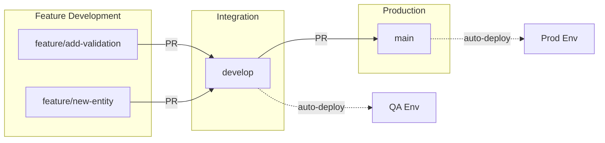
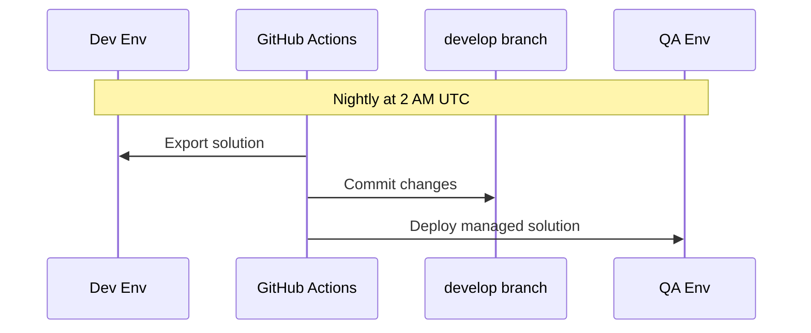
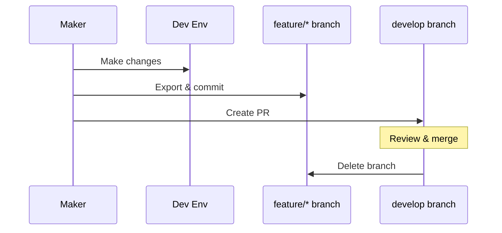
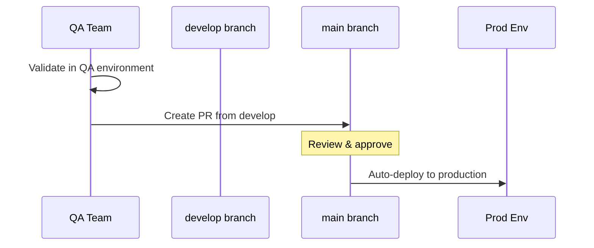

# Branching Strategy

This document defines our Git branching model and workflow for Power Platform solution development.

---

## Branch Overview

We use a simplified GitFlow model with two primary branches.

| Branch | Purpose | Protected | Deploys To |
|--------|---------|-----------|------------|
| `main` | Production-ready code | Yes | Prod |
| `develop` | Integration branch | Yes | QA |
| `feature/*` | Feature development | No | - |
| `hotfix/*` | Emergency fixes | No | - |

---

## Branch Flow



---

## Branch Details

### `main` Branch

**Purpose:** Represents production-ready code. Every commit to `main` should be deployable to production.

**Rules:**
- Protected branch (no direct commits)
- Requires pull request from `develop`
- Requires at least one approval
- All CI checks must pass

**Deployment:** Pushes to `main` trigger deployment to Production environment.

---

### `develop` Branch

**Purpose:** Integration branch where features are combined and tested before release.

**Rules:**
- Protected branch
- Receives automated exports from Dev environment (nightly)
- Receives pull requests from feature branches
- Can receive direct commits from automated export pipeline

**Deployment:** Pushes to `develop` trigger deployment to QA environment.

---

### `feature/*` Branches

**Purpose:** Isolated development of specific features or changes.

**Naming:** `feature/{short-description}`

**Examples:**
```
feature/add-account-validation
feature/new-contact-form
feature/update-business-rules
```

**Workflow:**
1. Create from `develop`
2. Make changes in Dev environment
3. Export and commit to feature branch
4. Create PR to `develop`
5. Delete after merge

---

### `hotfix/*` Branches

**Purpose:** Emergency fixes that need to go directly to production.

**Naming:** `hotfix/{issue-description}`

**Examples:**
```
hotfix/fix-critical-workflow
hotfix/security-patch
```

**Workflow:**
1. Create from `main`
2. Make minimal fix
3. PR to `main` (for immediate production deployment)
4. Cherry-pick or merge back to `develop`
5. Delete after merge

---

## Daily Workflow

### Automated Export (Nightly)



### Feature Development



### Production Release



---

## Pull Request Requirements

### PR to `develop`

| Requirement | Required? |
|-------------|-----------|
| CI pipeline passes | Yes |
| At least 1 approval | Recommended |
| No merge conflicts | Yes |
| Linked work item | Optional |

### PR to `main`

| Requirement | Required? |
|-------------|-----------|
| CI pipeline passes | Yes |
| At least 1 approval | Yes |
| QA sign-off | Yes |
| No merge conflicts | Yes |
| All conversations resolved | Yes |

---

## Merge Strategy

We use different merge strategies for different branch flows to optimize history clarity.

### Squash Merge: Feature → Develop

**Use squash merge** when merging feature branches into `develop`.

```
feature/add-validation (12 commits) → develop (1 squashed commit)
```

**Why squash:**
| Reason | Explanation |
|--------|-------------|
| Clean history | Feature branches have noisy commits ("WIP", "fix typo", "try again") |
| Atomic features | Each feature = one commit, easy to identify and revert |
| Power Platform | Solution exports create many small commits; squashing cleans this up |
| PR preserves detail | Granular commits still visible in closed PR if needed |

**GitHub setting:** Repository Settings → Pull Requests → Allow squash merging ✓

---

### Regular Merge: Develop → Main

**Use regular merge** (merge commit) when merging `develop` into `main`.

```
develop → main (merge commit preserves all feature commits)
```

**Why regular merge:**
| Reason | Explanation |
|--------|-------------|
| Preserves features | Each squashed feature commit flows through to main |
| Release boundaries | Merge commit marks exactly when a release happened |
| Traceability | "Prod broke" → Which release? → Which feature? → Easy to trace |
| Selective revert | Can revert one feature without reverting entire release |

**GitHub setting:** Repository Settings → Pull Requests → Allow merge commits ✓

---

### Why NOT Squash Both Ways?

If you squash `develop` → `main`:

```
❌ BAD: Squash develop to main
main:
├── Release 5 (one giant commit with 10 features mixed together)
├── Release 4 (one giant commit with 8 features)
└── Release 3 (one giant commit)

Problems:
- "Which feature broke prod?" - Can't tell, all mixed together
- "Revert just account validation" - Can't, it's mixed with other features
- Loss of audit trail
```

```
✅ GOOD: Regular merge develop to main
main:
├── Merge develop → main (Release 5)
│   ├── feat: add account validation
│   ├── feat: new contact form
│   └── fix: workflow error
├── Merge develop → main (Release 4)
│   ├── feat: dashboard updates
│   └── feat: reporting changes

Benefits:
- Clear release boundaries (merge commits)
- Feature-level granularity preserved
- Can revert specific features OR entire releases
```

---

## Branch Rulesets

We use **GitHub Rulesets** (not legacy branch protection) to enforce different merge strategies per branch. This is critical for our workflow:

- **Squash merge only** for PRs to `develop` (clean feature commits)
- **Merge commit only** for PRs to `main` (preserve feature history)

Ruleset definitions are stored in `.github/rulesets/` for reference.

### `main` Branch Ruleset

| Rule | Setting | Reason |
|------|---------|--------|
| Require PR | Yes | No direct commits to production |
| Required approvals | 1 | Human review before production |
| Dismiss stale reviews | Yes | Re-review after new commits |
| Require last push approval | Yes | Final review after any changes |
| Require conversation resolution | Yes | All feedback must be addressed |
| Status checks (strict) | Yes | Branch must be up-to-date |
| Required checks | `Validation Status` | PR validation workflow |
| Allowed merge methods | **Merge commit only** | Preserve feature commits on main |
| Branch deletion | Blocked | Prevent accidental deletion |
| Force pushes | Blocked | Protect history |

**Key:** `allowed_merge_methods: ["merge"]` - Squash is NOT allowed on main.

### `develop` Branch Ruleset

| Rule | Setting | Reason |
|------|---------|--------|
| Require PR | Yes | Feature branches merge via PR |
| Required approvals | 1 | Code review |
| Dismiss stale reviews | Yes | Re-review after changes |
| Require conversation resolution | Yes | All feedback must be addressed |
| Status checks (strict) | No | Nightly exports would conflict |
| Required checks | `Validation Status` | PR validation workflow |
| Allowed merge methods | **Squash only** | Clean feature history |
| Branch deletion | Blocked | Prevent accidental deletion |
| Force pushes | Blocked | Protect history |

**Key:** `allowed_merge_methods: ["squash"]` - Merge commits NOT allowed on develop.

> **Note:** Required approvals is set to 1 (not 0) to ensure code review even for the integration branch.

### Repository Merge Settings

Repository-level settings (Settings → Pull Requests) enable both methods:
- ✅ Allow merge commits (for main)
- ✅ Allow squash merging (for develop)
- ❌ Allow rebase merging (disabled)

**Squash commit formatting:** When squash merging to `develop`, commits use:
- **Title:** PR title (clean, descriptive feature name)
- **Message:** PR body (contains context, linked issues, etc.)

This ensures squashed commits are meaningful and traceable back to their PR.

The **rulesets** control which method is available for each target branch.

### Applying Rulesets

**Recommended:** Use the PowerShell script for idempotent setup (handles both create and update):

```powershell
# Configure all rulesets and merge settings
.\tools\Setup-BranchProtection.ps1

# Preview changes without applying
.\tools\Setup-BranchProtection.ps1 -WhatIf
```

**Manual API (initial creation only):**

```bash
# These POST commands only work for NEW rulesets (fail if already exists)
gh api repos/OWNER/REPO/rulesets -X POST --input .github/rulesets/develop.json
gh api repos/OWNER/REPO/rulesets -X POST --input .github/rulesets/main.json
```

See `.github/rulesets/` for the complete ruleset definitions.

### Automation Bypass for CI/CD

The nightly export workflow commits directly to `develop`, bypassing branch protection. This is **intentional and correct** for the ALM pattern.

#### Why Automation Bypasses Branch Protection

| Concern | Explanation |
|---------|-------------|
| "Shouldn't all changes require PR?" | No. PRs are for **human-authored changes**. Automated exports are operational, not developmental. |
| "What about review?" | QA environment IS the review. Blocking before QA adds delay without adding validation. |
| "What if bad changes export?" | If someone shouldn't change Dev, fix permissions. Don't slow the feedback loop for everyone. |

#### Where Gates Should Be

```
Dev → develop → QA       (automated, fast feedback)
QA  → main    → Prod     (gated, human approval required)
```

The human gate belongs at **QA → Prod**, not at **Dev → QA**. QA is where you validate changes through testing, not through XML diff review.

#### Configuration by Repository Type

**Organization Repositories (Enterprise):**

Add GitHub Actions to the ruleset bypass list:

1. Repository Settings → Rules → Rulesets → "Develop Branch Rules"
2. Under "Bypass list", add "GitHub Actions"
3. Save

**Personal Repositories:**

Use a Personal Access Token (PAT):

1. Create fine-grained PAT with `contents: write` for the repo
2. Store as `AUTOMATION_TOKEN` repository secret
3. Workflow uses PAT for checkout: `token: ${{ secrets.AUTOMATION_TOKEN }}`

This is the standard pattern when automation needs to bypass branch protection.

#### What This Enables

- **Nightly exports** commit directly to `develop`
- **QA deployment** triggers automatically on push
- **Fast feedback** - issues discovered within 24 hours
- **Human PRs** (feature branches) still require approval via `GITHUB_TOKEN`

---

## Commit Message Convention

Follow conventional commits for clear history:

```
<type>: <short description>

[optional body]

[optional footer]
```

**Types:**
| Type | Description |
|------|-------------|
| `feat` | New feature or component |
| `fix` | Bug fix |
| `docs` | Documentation changes |
| `chore` | Maintenance, dependencies |
| `refactor` | Code restructuring |

**Examples:**
```
feat: add account validation plugin
fix: correct status transition in workflow
docs: update deployment guide
chore: sync solution from Dev environment
```

---

## When to Deviate

### Add Release Branches When:
- You need to maintain multiple production versions
- Formal release cycles require stabilization periods
- Hotfixes need isolation from ongoing development

### Add Environment-Specific Branches When:
- Multiple long-lived environments need different configurations
- UAT requires extended testing periods
- Regulatory requirements mandate branch-per-environment

### Skip Feature Branches When:
- Solo developer working on simple changes
- Automated exports are the only commits
- Changes are trivial (typos, config adjustments)

---

## 🔗 See Also

- [ALM_OVERVIEW.md](ALM_OVERVIEW.md) - High-level ALM philosophy
- [ENVIRONMENT_STRATEGY.md](ENVIRONMENT_STRATEGY.md) - Environment configuration
- [PIPELINE_STRATEGY.md](PIPELINE_STRATEGY.md) - CI/CD implementation
- [Atlassian GitFlow Guide](https://www.atlassian.com/git/tutorials/comparing-workflows/gitflow-workflow) - GitFlow reference
