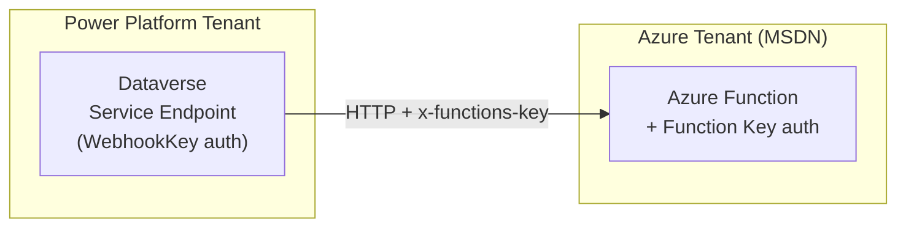
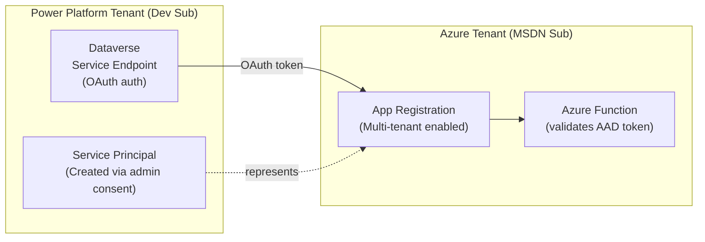
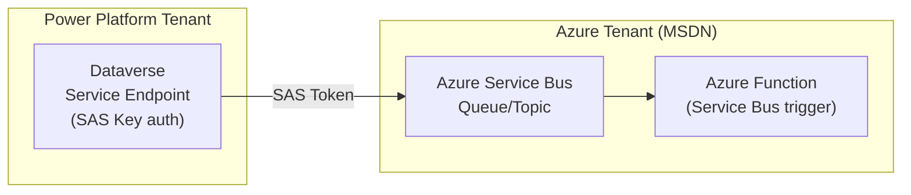
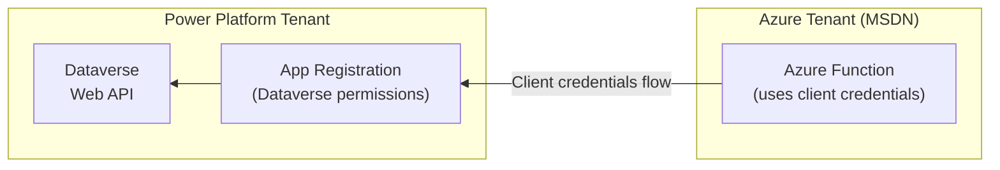

# Cross-Tenant Azure Integration Strategy

**Guidance for integrating Power Platform (Developer Subscription) with Azure resources in a separate tenant (e.g., MSDN Subscription).**

---

## Overview

This document addresses a common scenario: using Azure resources from a different Azure AD tenant than where your Power Platform environment exists. This is typical when:

- Power Platform is on a Developer/Trial subscription (no Azure)
- Azure resources are in an MSDN/Visual Studio subscription (different tenant)
- Production has separate tenants for organizational reasons

---

## Quick Reference

| Question | Answer |
|----------|--------|
| Can you use Azure from a different tenant? | **Yes**, but authentication setup matters |
| Do managed identities work cross-tenant? | **No**, they're tenant-bound |
| Can app registrations work cross-tenant? | **Yes**, via multi-tenant apps or B2B |

---

## Authentication Methods Comparison

| Auth Method | Cross-Tenant? | Complexity | Security | Best For |
|-------------|---------------|------------|----------|----------|
| Webhook Key (shared secret) | ✅ Yes | Low | Medium | Demo/Dev, internal systems |
| API Key in header | ✅ Yes | Low | Medium | Simple integrations |
| SAS Token (Service Bus) | ✅ Yes | Low | Medium | Queue-based patterns |
| Multi-tenant AAD App | ✅ Yes | Medium | High | Production, enterprise |
| Managed Identity | ❌ No | N/A | N/A | Same-tenant only |

---

## Architecture Patterns

### Pattern 1: Webhook Key Authentication (Simplest)

Best for demos, development, and internal trusted systems.

**Setup Steps:**

1. Create Azure Function in MSDN subscription
2. Get the function's key (host key or function key)
3. Create Service Endpoint in Dataverse with `WebhookKey` authentication type
4. Function validates `x-functions-key` header automatically

**Pros:**
- Simple to implement
- No AAD configuration required
- Works immediately cross-tenant

**Cons:**
- Shared secret management
- No identity context passed
- Less auditable

---

### Pattern 2: Multi-Tenant App Registration (Production-Ready)

Best for production scenarios requiring proper identity and audit trails.

**Setup Steps:**

1. **In Azure Tenant (MSDN):**
   - Create App Registration
   - Set "Supported account types" to **"Accounts in any organizational directory (Multi-tenant)"**
   - Create a client secret or certificate
   - Note the Application (client) ID and Directory (tenant) ID

2. **In Power Platform Tenant:**
   - Admin consent to the multi-tenant app (creates a service principal)
   - Or use the app directly if configuring Service Endpoint with OAuth

3. **Configure Dataverse Service Endpoint:**
   - Use OAuth authentication type
   - Provide the Application ID and secret

4. **Configure Azure Function:**
   - Enable AAD authentication
   - Validate tokens from the expected application

**Pros:**
- Proper identity-based authentication
- Full audit trail
- Token-based (short-lived credentials)
- Enterprise-grade security

**Cons:**
- More complex setup
- Requires admin consent in Power Platform tenant
- Secret/certificate rotation needed

---

### Pattern 3: Service Bus with SAS Token

Best for asynchronous, queue-based messaging patterns.

> ⚠️ **Session-Enabled Queues Not Supported:** Dataverse Service Endpoints do NOT set a `SessionId` on messages. If you enable sessions on a Service Bus queue (for FIFO ordering), messages from Dataverse will be rejected. Use standard (non-session) queues, or relay through an Azure Function that adds the SessionId before forwarding to a session-enabled queue.

**Setup Steps:**

1. Create Azure Service Bus namespace in MSDN subscription
2. Create a queue or topic
3. Generate a SAS policy with Send permissions
4. Create Service Endpoint in Dataverse pointing to Service Bus
5. Create Azure Function with Service Bus trigger

**Pros:**
- Decoupled architecture
- Built-in retry and dead-letter handling
- Scales well
- SAS tokens work cross-tenant

**Cons:**
- Additional Azure resource (Service Bus)
- Slightly higher complexity
- Asynchronous only (no sync response)

---

## Managed Identities: Why They Don't Work Cross-Tenant

Managed identities are **strictly tenant-bound**:

- The identity exists only in the Azure AD tenant where the resource lives
- Cannot authenticate to resources in another tenant
- Cannot be "shared" or "invited" to another tenant

**Implication:** If your Azure Function uses a managed identity, it can only access resources in that same Azure tenant (your MSDN subscription's tenant), not your Power Platform tenant's Dataverse directly.

**Workaround:** For Azure → Dataverse communication, use a multi-tenant app registration instead of managed identity.

---

## Bidirectional Communication

### Power Platform → Azure (Outbound)

This is the **easy direction**. All patterns above work:
- Service Endpoints push data to Azure
- Webhooks trigger Azure Functions
- Plugin → Service Endpoint → Azure

### Azure → Dataverse (Callback/Inbound)

This is **more complex** and requires additional setup:

**Options:**

1. **Multi-tenant app in Power Platform tenant**
   - Create app registration in PP tenant with Dataverse permissions
   - Azure Function uses client credentials flow
   - Function stores client ID/secret securely (Key Vault)

2. **Application User in Dataverse**
   - Create an Application User linked to the app registration
   - Assign appropriate security roles
   - Azure Function authenticates as this application user

---

## Important Considerations

### Security

| Consideration | Guidance |
|---------------|----------|
| IP Restrictions | Don't rely on IP allowlisting - Dataverse IPs are not static |
| Secret Storage | Use Azure Key Vault for production secrets |
| Token Lifetime | AAD tokens are short-lived (1 hour default) - handled automatically |
| Audit | Multi-tenant apps provide better audit trails than shared secrets |

### Performance

| Consideration | Impact |
|---------------|--------|
| Cross-tenant latency | Negligible - same Microsoft backbone |
| Cold start (Functions) | 1-3 seconds on consumption plan; use Premium for critical workloads |
| Service Bus | Adds ~10-50ms for queue operations |

### Cost (Minimal for Demo/Dev)

| Resource | Estimated Cost |
|----------|----------------|
| Azure Functions (Consumption) | Free tier: 1M executions/month |
| Storage Account (for Functions) | ~$1/month |
| Service Bus (Basic) | ~$0.05/million operations |
| Key Vault | ~$0.03/10,000 operations |

---

## Recommended Approach for PPDS Demo

### Phase 1: Webhook Pattern (Current Priority)

Implement the simplest cross-tenant pattern to demonstrate the concept:

1. **Azure Function** with HTTP trigger and function key auth
2. **Dataverse Service Endpoint** with WebhookKey authentication
3. **Plugin Step** registered to fire the service endpoint

**Why this approach:**
- Demonstrates the pattern clearly
- Minimal Azure cost
- Works immediately without AAD complexity
- Appropriate for demo/reference purposes

### Phase 2: Production Pattern (Future Enhancement)

Document and optionally implement multi-tenant OAuth:

1. Multi-tenant app registration
2. Proper token validation in Azure Function
3. Service Endpoint with OAuth authentication

**Document as:** "Production Enhancement" with clear migration path.

---

## Decision Log

| Decision | Rationale | Alternatives Considered |
|----------|-----------|------------------------|
| Use separate Azure tenant (MSDN) | Power Platform Developer subscription has no Azure; avoid additional cost | Upgrade PP subscription (expensive), use only Power Automate (limited scenarios) |
| Start with Webhook Key auth | Simplest cross-tenant pattern; appropriate for demo | Multi-tenant OAuth (more complex for demo), SAS tokens (requires Service Bus) |
| Document multi-tenant OAuth | Production-ready pattern should be documented | Ignore production pattern (incomplete guidance) |

---

## Related Documentation

- [Register a WebHook (Dataverse)](https://learn.microsoft.com/en-us/power-apps/developer/data-platform/register-web-hook)
- [Azure Integration (Dataverse)](https://learn.microsoft.com/en-us/power-apps/developer/data-platform/azure-integration)
- [Multi-tenant App Registration](https://learn.microsoft.com/en-us/azure/active-directory/develop/howto-convert-app-to-be-multi-tenant)
- [Azure Functions HTTP Trigger](https://learn.microsoft.com/en-us/azure/azure-functions/functions-bindings-http-webhook-trigger#authorization-keys)
