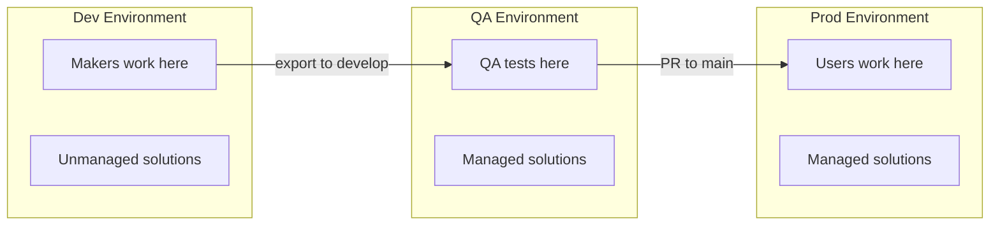

# Environment Strategy

This document defines our Power Platform environment structure, purposes, and configuration.

---

## Environment Overview

We use a three-environment model that balances simplicity with proper release management.

| Environment | Type | Purpose | Solution State | Branch |
|-------------|------|---------|----------------|--------|
| **Dev** | Development/Sandbox | Maker development and testing | Unmanaged | Source for `develop` |
| **QA** | Sandbox | Integration testing, QA validation | Managed | Deployed from `develop` |
| **Prod** | Production | Live production use | Managed | Deployed from `main` |

---

## Environment Details

### Dev Environment

**Purpose:** Where makers and developers build and test solutions.

**Characteristics:**
- Solutions exist in **unmanaged** state
- Makers have Environment Maker or System Customizer roles
- Changes are exported nightly (or on-demand) to `develop` branch
- May contain test data and experimental components

**Configuration:**
```
GitHub Environment: Dev
Variables:
  POWERPLATFORM_ENVIRONMENT_URL: https://org-dev.crm.dynamics.com/
  POWERPLATFORM_TENANT_ID: <tenant-id>
  POWERPLATFORM_CLIENT_ID: <service-principal-app-id>
Secrets:
  POWERPLATFORM_CLIENT_SECRET: <service-principal-secret>
```

**Who has access:**
- Makers (Environment Maker role)
- Developers (System Customizer role)
- Admins (System Administrator role)

---

### QA Environment

**Purpose:** Testing environment where QA validates changes before production.

**Characteristics:**
- Solutions deployed as **managed**
- Automatically receives deployments when `develop` branch is updated
- Should mirror production configuration as closely as possible
- Test data should be representative but not production data

**Configuration:**
```
GitHub Environment: QA
Variables:
  POWERPLATFORM_ENVIRONMENT_URL: https://org-qa.crm.dynamics.com/
  POWERPLATFORM_TENANT_ID: <tenant-id>
  POWERPLATFORM_CLIENT_ID: <service-principal-app-id>
Secrets:
  POWERPLATFORM_CLIENT_SECRET: <service-principal-secret>
```

**Who has access:**
- QA testers (Basic User + app-specific roles)
- Developers (read-only for debugging)
- Admins (System Administrator role)

---

### Prod Environment

**Purpose:** Live production environment for end users.

**Characteristics:**
- Solutions deployed as **managed**
- Receives deployments only when `main` branch is updated
- Should have approval gates before deployment
- No direct customization allowed

**Configuration:**
```
GitHub Environment: Prod (when added)
Variables:
  POWERPLATFORM_ENVIRONMENT_URL: https://org-prod.crm.dynamics.com/
  POWERPLATFORM_TENANT_ID: <tenant-id>
  POWERPLATFORM_CLIENT_ID: <service-principal-app-id>
Secrets:
  POWERPLATFORM_CLIENT_SECRET: <service-principal-secret>
Protection Rules:
  - Required reviewers: 1+
  - Wait timer: optional
```

**Who has access:**
- End users (app-specific security roles)
- Support staff (limited access for troubleshooting)
- Admins (System Administrator role, limited to emergencies)

---

## Environment Flow



---

## Service Principal Setup

Each environment requires a service principal (app registration) for automated deployments.

### Required Permissions

The service principal needs:
- **Dataverse:** System Administrator role (or custom role with solution import permissions)
- **Azure AD:** No special permissions required

### Creating the Service Principal

```bash
# Create app registration
az ad app create --display-name "Power Platform CI/CD"

# Create service principal
az ad sp create --id <app-id>

# Create client secret
az ad app credential reset --id <app-id>
```

### Registering in Power Platform

```bash
# Add application user to environment
pac admin assign-user \
  --environment <environment-url> \
  --user <app-id> \
  --role "System Administrator"
```

---

## When to Add More Environments

### Add UAT Environment When:
- Formal user acceptance testing is required
- Business stakeholders need sign-off before production
- Regulatory compliance requires documented testing phases

### Add Integration Environment When:
- Multiple teams work on different solutions
- Solutions have complex dependencies
- You need to validate solution interactions before QA

### Add Personal Developer Environments When:
- Multiple developers frequently conflict in shared Dev
- Developers need isolated experimentation space
- You have automation for environment provisioning

---

## Environment Naming Convention

| Environment | Suggested Name | URL Pattern |
|-------------|---------------|-------------|
| Dev | `{project}-dev` | `org-{project}-dev.crm.dynamics.com` |
| QA | `{project}-qa` | `org-{project}-qa.crm.dynamics.com` |
| UAT | `{project}-uat` | `org-{project}-uat.crm.dynamics.com` |
| Prod | `{project}-prod` | `org-{project}.crm.dynamics.com` |

---

## 🔗 See Also

- [ALM_OVERVIEW.md](ALM_OVERVIEW.md) - High-level ALM philosophy
- [BRANCHING_STRATEGY.md](BRANCHING_STRATEGY.md) - How branches map to environments
- [PIPELINE_STRATEGY.md](PIPELINE_STRATEGY.md) - Automated deployment configuration
- [Microsoft Environment Strategy](https://learn.microsoft.com/en-us/power-platform/alm/environment-strategy-alm) - Official guidance
