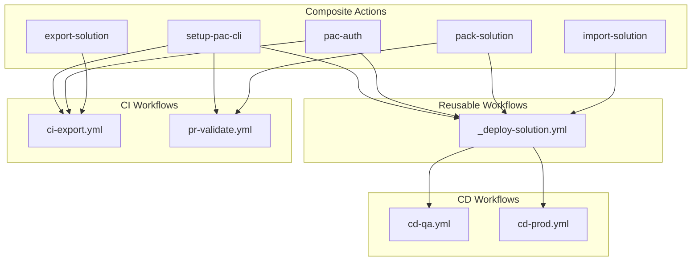
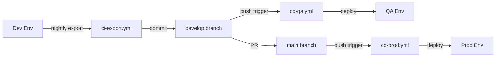

# Pipeline Strategy

This document explains our CI/CD approach for Power Platform solutions using GitHub Actions and PAC CLI.

---

## Why PAC CLI Over Alternatives

We use PAC CLI directly instead of `microsoft/powerplatform-actions` or Power Platform Pipelines.

| Approach | Pros | Cons | Our Choice |
|----------|------|------|------------|
| **PAC CLI** | Portable, reliable, full control | More setup | Selected |
| **powerplatform-actions** | Less code | Download issues, less portable | Not used |
| **Power Platform Pipelines** | Built-in, simple | No source control | Not used |

**Rationale:**

1. **Reliability** - PAC CLI installs from NuGet, avoiding GitHub action download issues
2. **Portability** - Same commands work in Azure DevOps with minimal changes
3. **Transparency** - Direct commands are easier to debug than wrapped actions
4. **Extensibility** - Full control over validation, error handling, and custom logic

---

## Pipeline Architecture



### Data Flow



---

## Workflow File Naming Convention

### File Names

| Type | Pattern | Example |
|------|---------|---------|
| Reusable workflow | `_name.yml` (underscore prefix) | `_deploy-solution.yml` |
| CI workflow | `ci-{purpose}.yml` | `ci-export.yml` |
| CD workflow | `cd-{target}.yml` | `cd-qa.yml`, `cd-prod.yml` |
| PR workflow | `pr-{purpose}.yml` | `pr-validate.yml` |

### UI Display Names (`name:` field)

| Pattern | Example |
|---------|---------|
| `CI: {Description}` | `CI: Export from Dev` |
| `CD: Deploy to {Target}` | `CD: Deploy to QA` |
| `PR: {Description}` | `PR: Validate Solution` |

---

## Workflow Files

| Workflow | Trigger | Purpose |
|----------|---------|---------|
| `ci-export.yml` | Nightly schedule, manual | Export from Dev to develop branch |
| `cd-qa.yml` | Push to develop, manual | Deploy to QA environment |
| `cd-prod.yml` | Push to main, manual | Deploy to Production environment |
| `pr-validate.yml` | PR to develop/main | Validate solution, build code, run Solution Checker |
| `codeql.yml` | Push, PR, weekly schedule | Security scanning for C# code |
| `_deploy-solution.yml` | Called by cd-* workflows | Reusable deploy pattern |

---

## Composite Actions

Reusable step sequences are extracted into composite actions in `.github/actions/`:

| Action | Purpose | Key Inputs |
|--------|---------|------------|
| `setup-pac-cli` | Install .NET and PAC CLI | `dotnet-version` |
| `pac-auth` | Authenticate to environment | `environment-url`, `tenant-id`, `client-id`, `client-secret` |
| `pack-solution` | Pack solution from source | `solution-folder`, `solution-name`, `package-type` |
| `import-solution` | Import solution to environment | `solution-path`, `force-overwrite` |
| `export-solution` | Export and unpack solution | `solution-name`, `output-folder` |
| `build-solution` | Build .NET solution | `solution-path`, `configuration`, `run-tests` |
| `copy-plugin-assemblies` | Copy classic DLLs to solution | `source-assembly`, `solution-folder` |
| `copy-plugin-packages` | Copy plugin packages to solution | `source-package`, `solution-folder` |
| `check-solution` | Run Solution Checker | `solution-path`, `fail-on-level` |
| `analyze-changes` | Detect meaningful changes | `solution-folder` |

### Usage Example

```yaml
steps:
  - name: Checkout
    uses: actions/checkout@v4

  - name: Setup PAC CLI
    uses: ./.github/actions/setup-pac-cli

  - name: Authenticate
    uses: ./.github/actions/pac-auth
    with:
      environment-url: ${{ vars.POWERPLATFORM_ENVIRONMENT_URL }}
      tenant-id: ${{ vars.POWERPLATFORM_TENANT_ID }}
      client-id: ${{ vars.POWERPLATFORM_CLIENT_ID }}
      client-secret: ${{ secrets.POWERPLATFORM_CLIENT_SECRET }}

  - name: Build managed solution
    run: dotnet build solutions/PPDSDemo/PPDSDemo.cdsproj -c Release

  - name: Import solution
    uses: ./.github/actions/import-solution
    with:
      solution-path: solutions/PPDSDemo/bin/Release/PPDSDemo.zip
```

---

## Reusable Workflow

The `_deploy-solution.yml` workflow encapsulates the full deploy pattern:

```yaml
jobs:
  deploy-to-qa:
    uses: ./.github/workflows/_deploy-solution.yml
    with:
      environment-name: QA
      solution-name: PPDSDemo
      solution-folder: solutions/PPDSDemo/src
      ref: develop
    secrets: inherit
```

**Inputs:**
| Input | Required | Description |
|-------|----------|-------------|
| `environment-name` | Yes | GitHub environment (Dev, QA, Prod) |
| `solution-name` | Yes | Solution unique name |
| `solution-folder` | Yes | Path to solution source folder |
| `ref` | No | Git ref to checkout |

> **Note:** The solution source uses `--packagetype Both` format, enabling Release builds to produce managed solutions.

---

## Environment Configuration

### GitHub Environments

Each Power Platform environment maps to a GitHub environment:

```
GitHub Environment: Dev / QA / Prod
├── Variables:
│   ├── POWERPLATFORM_ENVIRONMENT_URL
│   ├── POWERPLATFORM_TENANT_ID
│   └── POWERPLATFORM_CLIENT_ID
└── Secrets:
    └── POWERPLATFORM_CLIENT_SECRET
```

### Variable Naming

| Variable | Description | Example |
|----------|-------------|---------|
| `POWERPLATFORM_ENVIRONMENT_URL` | Dataverse URL | `https://org.crm.dynamics.com/` |
| `POWERPLATFORM_TENANT_ID` | Azure AD tenant | `xxxxxxxx-xxxx-xxxx-xxxx-xxxxxxxxxxxx` |
| `POWERPLATFORM_CLIENT_ID` | Service principal app ID | `xxxxxxxx-xxxx-xxxx-xxxx-xxxxxxxxxxxx` |
| `POWERPLATFORM_CLIENT_SECRET` | Service principal secret | (stored as secret) |

---

## Adding New Workflows

The modular architecture makes adding new workflows simple:

### Example: Add UAT Deployment

```yaml
# .github/workflows/cd-uat.yml
name: 'CD: Deploy to UAT'

on:
  workflow_dispatch:
    inputs:
      solution_name:
        default: 'PPDSDemo'

jobs:
  deploy-to-uat:
    uses: ./.github/workflows/_deploy-solution.yml
    with:
      environment-name: UAT  # Create this GitHub environment
      solution-name: ${{ github.event.inputs.solution_name || 'PPDSDemo' }}
      solution-folder: solutions/PPDSDemo/src
    secrets: inherit
```

### Example: Add Solution Checker

```yaml
# In any workflow, add solution checker step:
- name: Run Solution Checker
  run: |
    pac solution check \
      --path "${{ steps.pack.outputs.solution-path }}" \
      --outputDirectory "./reports"

- name: Upload checker results
  uses: actions/upload-artifact@v4
  with:
    name: solution-checker-results
    path: ./reports/
```

---

## Error Handling

### Retry Logic

```yaml
- name: Import Solution with Retry
  uses: nick-fields/retry@v2
  with:
    timeout_minutes: 30
    max_attempts: 3
    command: |
      pac solution import \
        --path "./exports/${{ env.SOLUTION_NAME }}_managed.zip" \
        --force-overwrite
```

### Failure Notifications

```yaml
- name: Notify on Failure
  if: failure()
  run: |
    # Send notification (Teams, Slack, email, etc.)
    echo "Deployment failed for ${{ env.SOLUTION_NAME }}"
```

---

## Migration to Azure DevOps

The PAC CLI commands are identical in Azure DevOps. Only the pipeline syntax changes:

**GitHub Actions:**
```yaml
- name: Export Solution
  run: pac solution export --name "MySolution" --path "./solution.zip"
```

**Azure DevOps:**
```yaml
- script: pac solution export --name "MySolution" --path "./solution.zip"
  displayName: 'Export Solution'
```

For authentication, Azure DevOps uses the Power Platform Build Tools extension or service connections instead of direct PAC CLI auth.

---

## Current Features

| Feature | Description | Status |
|---------|-------------|--------|
| Solution Checker | Automated quality gates in PR validation | Done |
| CodeQL scanning | Security analysis for C# code | Done |
| Dependency Review | Block PRs with vulnerable dependencies | Done |
| Plugin build integration | Build and copy assemblies/packages | Done |
| Version stamping | X.X.YYYYMMDD.BuildNumber format | Done |

## Future Enhancements

| Enhancement | Description | Priority |
|-------------|-------------|----------|
| Approval gates | Manual approval for production | Medium |
| Multi-solution templates | Dependency-aware deployments | Medium |
| Rollback automation | Quick rollback on failure | Low |

---

## See Also

- [ALM_OVERVIEW.md](ALM_OVERVIEW.md) - High-level ALM philosophy
- [ENVIRONMENT_STRATEGY.md](ENVIRONMENT_STRATEGY.md) - Environment configuration
- [BRANCHING_STRATEGY.md](BRANCHING_STRATEGY.md) - Git workflow
- [PAC CLI Reference](https://learn.microsoft.com/en-us/power-platform/developer/cli/reference/) - Official documentation
